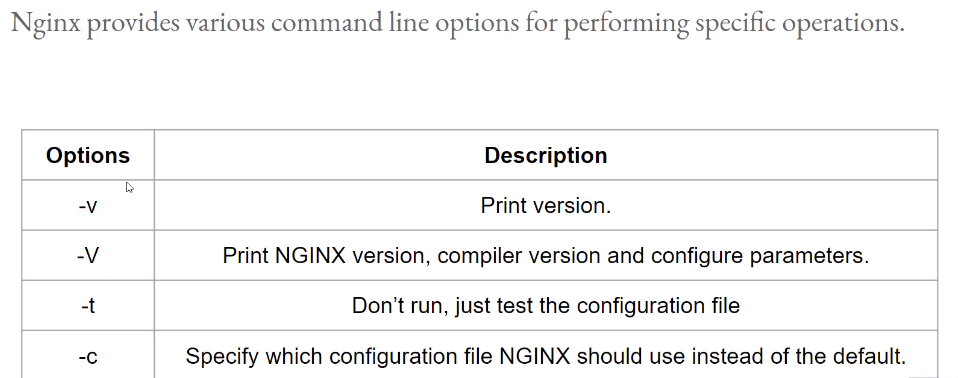

## Configuration file
- nginx config file resides under `/etc/nginx/nginx.conf`
- log file stored in `/var/log/nginx`

## The NGINX Process Model


```bash
>> ps -aux | grep nginx

root      3134  0.0  0.0  40080   972 ?        Ss   06:37   0:00 nginx: master process /usr/sbin/nginx  #<----
nginx     3135  0.0  0.3  40520  2932 ?        S    06:37   0:00 nginx: worker process  #<----
ec2-user  5736  0.0  0.0 119424   928 pts/0    S+   10:07   0:00 grep --color=auto nginx
```

As we can see, `master` process running as `root` user. and `worker` process running as `nginx` user.
We can also change worker node number by changing in the `nginx.conf` file. By default `worker` node running based on the number of `cpu-core`

```bash
# nginx.conf

user nginx;
worker_processes 2;  #<---
error_log /var/log/nginx/error.log;
pid /run/nginx.pid;
```

```bash
>> ps -aux | grep nginx

root      5876  0.0  0.0  40080   972 ?        Ss   10:16   0:00 nginx: master process /usr/sbin/nginx
nginx     5877  0.0  0.2  40520  2888 ?        S    10:16   0:00 nginx: worker process #<---1
nginx     5878  0.0  0.2  40520  2888 ?        S    10:16   0:00 nginx: worker process #<---2
ec2-user  5885  0.0  0.0 119424   948 pts/0    S+   10:17   0:00 grep --color=auto nginx
```
### PID
```bash
pid /run/nginx.pid;  # pid of the master process
```


