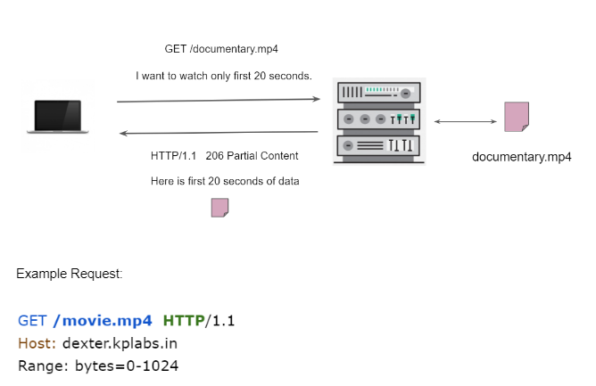

The partial GET method is used to retrieve only specific content instead of everything



### Normal Get:

```bash
>> curl dexter.kplabs.in/partial.txt
1
2
3
4
5
6
7
8
9
..
...
```

```bash
>> curl -I dexter.kplabs.in/partial.txt
HTTP/1.1 200 OK
Server: nginx/1.20.1
Date: Tue, 12 Sep 2023 07:44:28 GMT
Content-Type: text/plain
Content-Length: 292  # 292 bytes as response
Last-Modified: Wed, 18 Oct 2017 05:58:53 GMT
Connection: keep-alive
ETag: "59e6ed9d-124"
Accept-Ranges: bytes
```

### Partial Get:
```bash
>> curl --header "Range: bytes=0-20" dexter.kplabs.in/partial.txt
1
2
3
4
5
6
7
8
9
10
```
```bash
>> curl --header "Range: bytes=20-40" dexter.kplabs.in/partial.txt

11
12
13
14
15
16
17
```
```bash
>> curl -I --header "Range: bytes=20-40" dexter.kplabs.in/partial.txt

HTTP/1.1 206 Partial Content
Server: nginx/1.20.1
Date: Tue, 12 Sep 2023 07:47:41 GMT
Content-Type: text/plain
Content-Length: 21  #<<--------
Last-Modified: Wed, 18 Oct 2017 05:58:53 GMT
Connection: keep-alive
ETag: "59e6ed9d-124"
Content-Range: bytes 20-40/292
```
```bash
>> curl -I --header "Range: bytes=0-40" dexter.kplabs.in/partial.txt

HTTP/1.1 206 Partial Content
Server: nginx/1.20.1
Date: Tue, 12 Sep 2023 07:47:52 GMT
Content-Type: text/plain
Content-Length: 41  #<<--------
Last-Modified: Wed, 18 Oct 2017 05:58:53 GMT
Connection: keep-alive
ETag: "59e6ed9d-124"
Content-Range: bytes 0-40/292
```