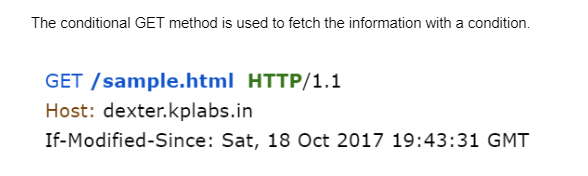

```bash
>> curl -I --header "If-Modified-Since: Wed, 21 Oct 2015 07:28:00 GMT" dexter.kplabs.in

HTTP/1.1 200 OK  #<<-------
Server: nginx/1.20.1
Date: Tue, 12 Sep 2023 07:57:06 GMT
Content-Type: text/html
Content-Length: 82
Last-Modified: Wed, 18 Oct 2017 04:32:55 GMT
Connection: keep-alive
ETag: "59e6d977-52"
Accept-Ranges: bytes
```

```bash
>> curl -I --header "If-Modified-Since: Wed, 18 Oct 2017 05:19:43 GMT" dexter.kplabs.in/sample.html

HTTP/1.1 304 Not Modified #<<------
Server: nginx/1.20.1
Date: Tue, 12 Sep 2023 07:59:38 GMT
Last-Modified: Wed, 18 Oct 2017 05:19:43 GMT
Connection: keep-alive
ETag: "59e6e46f-4c"
```

```bash
>> curl -I --header "If-Modified-Since: Wed, 18 Oct 2018 05:19:42 GMT" dexter.kplabs.in/sample.html

HTTP/1.1 200 OK  #<<------
Server: nginx/1.20.1
Date: Tue, 12 Sep 2023 07:59:45 GMT
Content-Type: text/html
Content-Length: 76
Last-Modified: Wed, 18 Oct 2017 05:19:43 GMT
Connection: keep-alive
ETag: "59e6e46f-4c"
Accept-Ranges: bytes
```