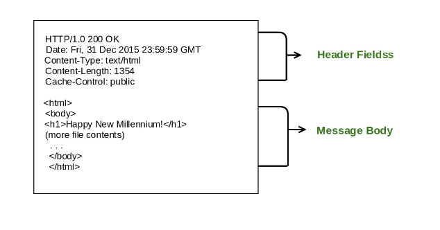

HEAD method is used to fetch only the HTTP headers as part of the response.

HEAD method is identical to GET method, except that the server MUST NOT return a message-body in the response

Example :

```
curl -I dexter.kplabs.in
```

